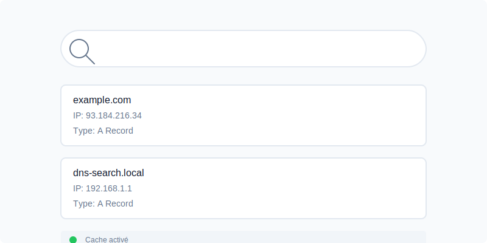

<div align="center">

# 🔍 DNS Search Tool

*Une interface moderne pour vos recherches DNS*

[]() 
[]() 
[]())

<p align="center">
  
</p>

</div>

---

## ⚡️ Démarrage Ultra Rapide

Lancez votre recherche DNS en une commande :

```bash
curl -sSL https://raw.githubusercontent.com/nabz0r/dns-search/main/scripts/install.sh | bash
```

<p align="center">
  <i>Votre outil DNS sera prêt sur http://localhost:3000</i>
</p>

## ✨ Points Forts

🚀 **Simple et Puissant**
- Interface épurée style Google
- Résultats instantanés
- Cache intelligent

📊 **Analytique Intégrée**
- Historique des recherches
- Métriques en temps réel
- Export des données

🛡️ **Fiable et Sécurisé**
- Validation des entrées
- Protection contre les abus
- Logging détaillé

## 📚 Documentation

Explorez notre guide complet dans [GUIDE.md](GUIDE.md) :

- 🔧 Installation et configuration
- 📖 Utilisation quotidienne
- 🩺 Dépannage détaillé
- 🔄 Maintenance et mises à jour

## 🤔 Un problème ?

Pas de panique ! Vérifions ensemble :

```bash
# Vérifiez votre environnement
./scripts/check-environment.sh

# Consultez les logs
cat install.log

# Exécutez le diagnostic
./scripts/diagnose.sh
```

## 💬 Support

Besoin d'aide ? Nous sommes là :

1. 📖 [Consultez le guide](GUIDE.md)
2. 🔍 [Parcourez les issues](https://github.com/nabz0r/dns-search/issues)
3. ✍️ [Ouvrez un ticket](https://github.com/nabz0r/dns-search/issues/new)

## 🤝 Contribuer

Vos contributions sont les bienvenues ! Consultez notre [guide de contribution](CONTRIBUTING.md).

## 📝 Licence

Ce projet est sous licence MIT. Voir le fichier [LICENSE](LICENSE) pour plus de détails.

---

<div align="center">
Créé avec ❤️ pour la communauté
</div>
